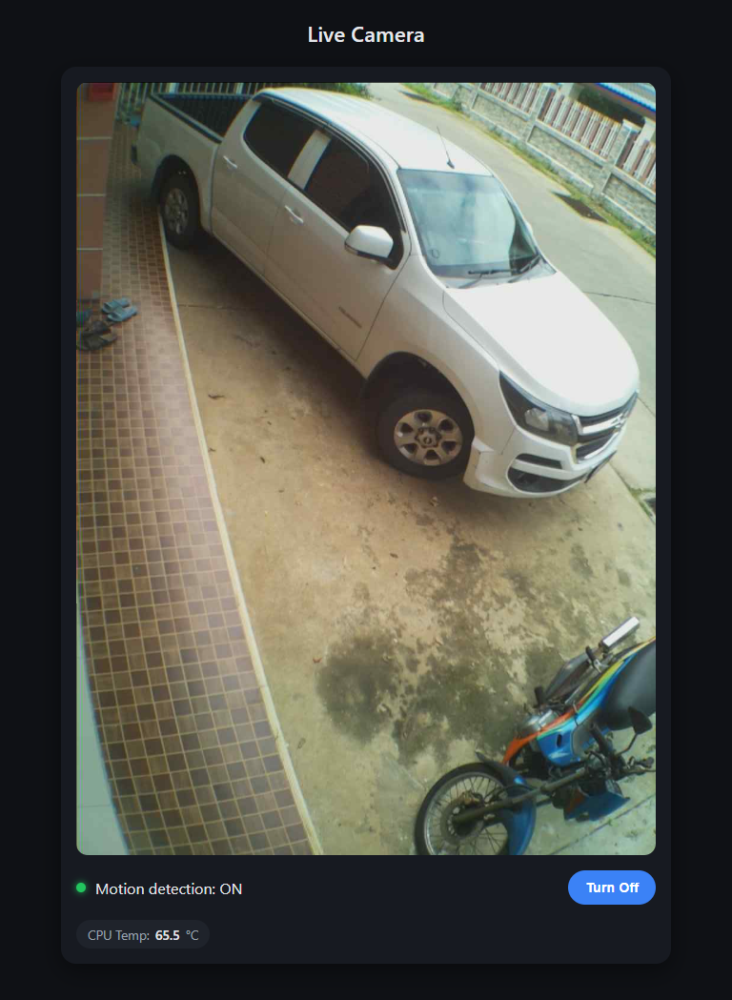

# Raspberry Pi Camera Streaming over Tailscale

Live MJPEG streaming server with toggleable motion detection, running on a Raspberry Pi Zero 2 W with a CSI camera. Viewable on the local network, and remotely over a Tailscale mesh rather than by port-forwarding to the public internet.

The stream has no built-in authentication. That is a deliberate design decision, not an oversight: rather than bolting auth onto the server, access control is handled at the network layer by Tailscale, so the service is only reachable by devices on the tailnet. Do not port-forward 8090.

## Overview

- **Platform:** Raspberry Pi Zero 2 W, Raspberry Pi OS Lite (32-bit or 64-bit)
- **Camera:** CSI camera module, tested with OV5647-based modules (official Camera Module v1, Joy-IT clones)
- **Stream:** MJPEG over HTTP on port 8090, full-sensor 1296x972 main stream plus a 320x240 lores stream
- **Motion detection:** frame-difference on the lores stream, toggleable from the web UI, snapshots written to disk with a cooldown
- **Process management:** systemd service with restart policy, cron-scheduled start and stop
- **Remote access:** Tailscale, with `tailscale serve` for HTTPS




## Repository contents

| File | Purpose |
| --- | --- |
| `stream.py` | The streaming server: Picamera2 capture, MJPEG encoding, motion detection thread, and the web UI |
| `README.md` | This guide |
| `cameras.html` | Static multi-camera viewing page |

## Skills demonstrated

- Linux system administration (Raspberry Pi OS Lite headless, systemd, cron, apt, journalctl)
- Networking (mDNS resolution and fallback, DHCP-assigned addressing, Tailscale mesh VPN, `tailscale serve`)
- Security reasoning (network-layer access control instead of exposing an unauthenticated service)
- Python (threading, HTTP server, NumPy frame differencing, Picamera2)
- Hardware bring-up (CSI ribbon orientation, sensor detection, `dtoverlay` selection, thermal monitoring)
- Documentation of failure modes and recovery paths

---

## Requirements

- Raspberry Pi Zero 2 W (or any Pi with a CSI camera port)
- A compatible CSI camera module (tested with OV5647-based modules, e.g. official Camera Module v1 or Joy-IT clones)
- MicroSD card (8GB+)
- A computer to flash the SD card and SSH in from
- [Raspberry Pi Imager](https://www.raspberrypi.com/software/)

This guide assumes you are adding a new camera Pi and already have `stream.py` in this repo. No need to recreate it from scratch, just copy it over.

---

## 1. Flash the SD card

1. Open Raspberry Pi Imager on your computer.
2. **Device:** select your Pi model (e.g. Raspberry Pi Zero 2 W).
3. **OS:** choose Raspberry Pi OS Lite (32-bit or 64-bit both work).
4. Before writing, click the gear icon to open OS customization:
   - **Set hostname** — pick something unique per camera (e.g. `piCam3`) so you can tell devices apart on your network.
   - **Enable SSH** — check "Enable SSH", choose "Use password authentication".
   - **Set username and password.**
   - **Configure WiFi** — enter your SSID and password so it connects on first boot.
   - Save.
5. Click **Write**, confirm, and let it finish writing and verifying.

## 2. First boot and connect

Insert the SD card into the Pi, connect the camera ribbon cable (check orientation: the blue side of the cable typically faces away from the camera board, and must be fully seated on both ends), then power it on.

Give it 1-2 minutes for first boot.

SSH in from your computer:

```bash
ssh <username>@<hostname>.local
```

Or find the IP via your router's device list if `.local` resolution doesn't work.

## 3. Update the system

```bash
sudo apt update && sudo apt full-upgrade -y
sudo reboot
```

Reconnect via SSH after it reboots.

## 4. Confirm the camera is detected

```bash
rpicam-hello --list-cameras
```

You should see your sensor listed (e.g. `ov5647`) along with its supported resolution modes. If nothing shows up, check the ribbon cable seating and orientation before continuing.

## 5. Install dependencies

```bash
sudo apt install -y python3-picamera2 --no-install-recommends
pip install numpy --break-system-packages
```

## 6. Set up the streaming script

Create the snapshots folder (used for motion-triggered captures):

```bash
mkdir -p ~/motion_snapshots
```

Copy `stream.py` from this repo onto the Pi (e.g. via `scp` from your computer):

```bash
scp stream.py <username>@<pi-ip-or-hostname>.local:~/stream.py
```

Confirm your username matches the path used inside `stream.py` (it defaults to `/home/pi/...`):

```bash
whoami
```

If it's not `pi`, edit the `fname` line inside `stream.py`'s `motion_detector()` function to match your actual home directory.

Set the rotation to match how the camera is physically mounted, near the top of `stream.py`:

```python
ROTATION_DEG = 90  # 0, 90, 180, 270 etc
```

## 7. Test manually before making it a service

```bash
python3 ~/stream.py
```

Find the Pi's local IP if you don't have it:

```bash
hostname -I
```

Open in a browser on another device on the same network:

```
http://<pi-ip>:8090/
```

Confirm:

- Live video shows up with correct orientation
- Motion detection toggle button works
- CPU temp shows and updates

Press `Ctrl+C` in the terminal to stop the test once confirmed.

## 8. Set up as a persistent systemd service

```bash
sudo nano /etc/systemd/system/camstream.service
```

Paste in (replace `pi` with your actual username in both `User=` and the `ExecStart` path if different):

```ini
[Unit]
Description=Pi Camera MJPEG Streaming Server
After=network.target

[Service]
Type=simple
User=pi
ExecStart=/usr/bin/python3 /home/pi/stream.py
Restart=always
RestartSec=5

[Install]
WantedBy=multi-user.target
```

Save and exit (`Ctrl+O`, Enter, `Ctrl+X`), then:

```bash
sudo systemctl daemon-reload
sudo systemctl enable --now camstream
sudo systemctl status camstream
```

Confirm it shows `active (running)`.

### Scheduled start and stop

```bash
sudo crontab -e
```

Add to the bottom:

```
0 22 * * * systemctl stop camstream
0 6 * * * systemctl start camstream
```

### Manual on/off

```bash
sudo systemctl stop camstream
sudo systemctl start camstream
```

## 9. Set up remote access with Tailscale

This lets you view the stream from outside your home network without exposing it publicly. The stream has no built-in authentication, so avoid port-forwarding it directly to the internet.

```bash
curl -fsSL https://tailscale.com/install.sh | sh
sudo tailscale up
```

Open the printed login URL in a browser and approve the device under your Tailscale account. Install Tailscale on whatever device you'll view the stream from too (phone/laptop), logged into the same account.

Get this Pi's Tailscale IP:

```bash
tailscale ip -4
```

From any device connected to your Tailscale network (on any WiFi or cellular data), open:

```
http://<tailscale-ip>:8090/
```

### Enable HTTPS serving

**This is the step that has caused every "device shows offline" issue so far.** If the node appears offline or the stream won't load over Tailscale, check this first.

```bash
sudo tailscale serve --bg 8090
tailscale serve status
```

## 10. Reboot test

Confirm everything comes back automatically without manual intervention:

```bash
sudo reboot
```

Wait 30-60 seconds, then load the stream URL again (local or Tailscale) without SSHing in or running anything manually first.

## 11. Viewing multiple cameras on one page

Since each Pi runs its own independent stream server, you can view several at once with a simple static HTML page on your own computer or phone. No server needed.

```html
<!DOCTYPE html>
<html>
<head>
    <title>My Cameras</title>
    <style>
        body { background: #222; font-family: sans-serif; text-align: center; }
        .cam { display: inline-block; margin: 10px; }
        img { width: 480px; border: 2px solid #555; }
        h3 { color: #eee; }
    </style>
</head>
<body>
    <div class="cam">
        <h3>Camera 1</h3>
        :8090/stream.mjpg" />
    </div>
    <div class="cam">
        <h3>Camera 2</h3>
        :8090/stream.mjpg" />
    </div>
    <!-- Add more .cam blocks as needed -->
</body>
</html>
```

Save as an `.html` file and open it directly in a browser. There is no hard software limit on how many cameras you can add. The practical limits are your viewing device's bandwidth (each stream is roughly 1-3 Mbps) and each Pi's own CPU handling its own encoding independently.

---

## Troubleshooting

### Camera not detected

`rpicam-hello --list-cameras` shows nothing:

- Recheck ribbon cable seating and orientation.
- Confirm `/boot/firmware/config.txt` has `camera_auto_detect=1`.
- For third-party sensors, you may need to set `camera_auto_detect=0` and add an explicit `dtoverlay=<sensor>` line (e.g. `dtoverlay=imx219` for Camera Module 3).

### Service fails to start or crash-loops

```bash
sudo systemctl status camstream
sudo journalctl -u camstream -n 30 --no-pager
```

Common causes:

- **Python syntax errors from manual edits.** Verify with `python3 -m py_compile ~/stream.py && echo OK` before restarting the service.
- **Mixed tabs and spaces in indentation (`TabError`).** If this happens after copy-pasting edits, run `sed -i 's/\t/    /g' ~/stream.py` to normalize to spaces, then re-check indentation levels manually.
- **Missing commas** between dictionary or function arguments after editing config blocks.

### Video appears cropped or too small

Make sure `stream.py`'s video configuration uses a full-sensor mode (e.g. `main={"size": (1296, 972)}` for OV5647, which is a full-sensor-crop resolution) rather than a size that falls into a cropped mode. The page's responsive JavaScript sizing (via `naturalWidth`/`naturalHeight`) should handle displaying whatever resolution is configured without further CSS changes.

### Stream shows offline over Tailscale

Check `tailscale serve` is running:

```bash
sudo tailscale serve --bg 8090
tailscale serve status
```

### Checking CPU temperature manually

```bash
vcgencmd measure_temp
```

Safe operating range is well under 70°C for sustained use. Throttling starts around 80°C.

### Viewing motion snapshots

Saved on the Pi under `~/motion_snapshots/`. Pull them to your computer with:

```bash
scp <username>@<pi-ip>:~/motion_snapshots/*.jpg .
```

---

## Known limitations

- **No authentication on the stream.** Access control is delegated entirely to Tailscale. Anyone on the same LAN can view the stream. Do not expose port 8090 to the internet.
- **No client limit.** The server binds to all interfaces and accepts unlimited concurrent stream connections. A handful will saturate a Zero 2 W.
- **Motion detection is naive.** It uses mean absolute frame difference on the lores stream, so lighting changes will trigger it. `MOTION_THRESHOLD` and `MOTION_COOLDOWN` are tunable at the top of `stream.py`.
- **Snapshots are never rotated or pruned.** `~/motion_snapshots/` will grow until the SD card fills.

## Possible improvements

- [ ] Basic auth or a token on the stream endpoint, for LAN defence in depth
- [ ] Snapshot retention policy or automated pruning
- [ ] Client connection limit
- [ ] Tailscale ACLs to restrict which tailnet devices can reach the cameras
- [ ] Motion detection tuned per camera rather than globally

## License

MIT
